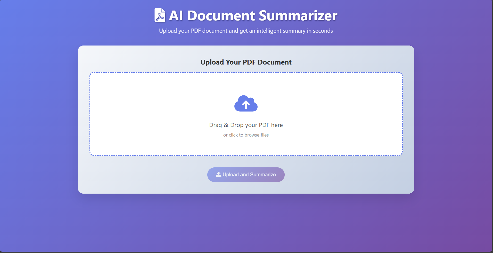
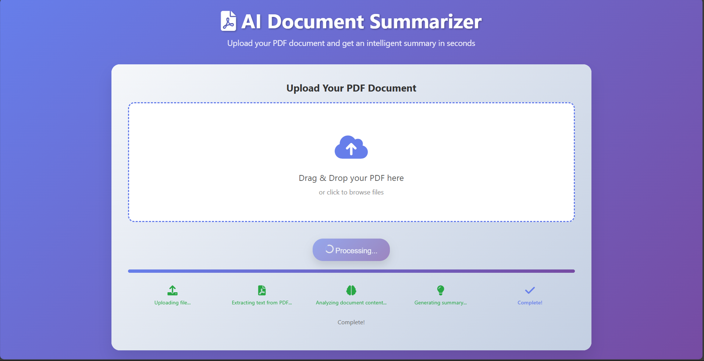
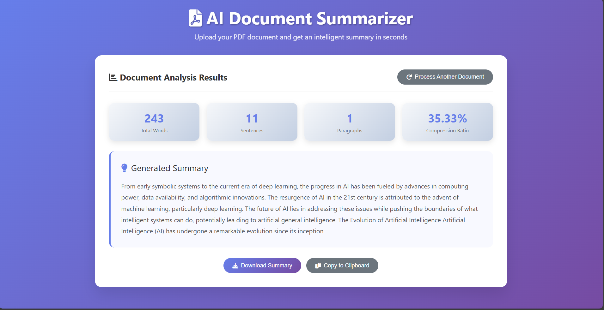

# AI Document Summarizer

## Overview
AI Document Summarizer is a web application that allows users to upload PDF documents and receive concise, AI-generated summaries. It uses advanced extractive summarization techniques (TextRank) and keyword analysis to provide high-quality summaries of academic papers, reports, and other documents.

## Features
- Upload PDF files and get instant summaries
- Advanced TextRank-based extractive summarization
- Keyword enhancement for more informative summaries
- User-friendly web interface
- Download summary as text file
- Example PDFs and result images included

## Directory Structure
```
AI_doc_summarizer/
├── app.py                # Main Flask application
├── requirements.txt      # Python dependencies
├── templates/
│   └── index.html        # Web UI template
├── pdfs/                 # Example PDF files
├── results/              # Example result images
├── venv/                 # Python virtual environment (should be ignored by git)
```

## Setup Instructions
1. **Clone the repository**
   ```bash
   git clone <repo-url>
   cd AI_doc_summarizer
   ```
2. **Create and activate a virtual environment**
   ```bash
   python -m venv venv
   # On Windows:
   venv\Scripts\activate
   # On macOS/Linux:
   source venv/bin/activate
   ```
3. **Install dependencies**
   ```bash
   pip install -r requirements.txt
   ```
4. **Run the application**
   ```bash
   python app.py
   ```
5. **Open your browser** and go to `http://127.0.0.1:5000/`

## Usage
- Upload a PDF file using the web interface.
- Wait for the summary to be generated and displayed.
- Download the summary if desired.

## Summarization Algorithm: TextRank
TextRank is an unsupervised graph-based ranking algorithm inspired by PageRank, used for extractive text summarization. Here’s how it works in this project:

1. **Sentence Tokenization**: The document is split into sentences.
2. **Sentence Similarity Graph**: Each sentence is a node. Edges are weighted by the similarity between sentences (using word overlap/cosine similarity).
3. **Graph Construction**: A similarity matrix is built, and each sentence is connected to others based on similarity.
4. **Score Propagation**: The TextRank algorithm iteratively updates the score of each sentence based on the scores of neighboring sentences, using a damping factor (typically 0.85).
5. **Summary Selection**: The top-ranked sentences are selected to form the summary, preserving their original order for coherence.

This approach ensures that the most central and informative sentences are included in the summary, making it both concise and representative of the original document.

---

## Results
Below are example results generated by the AI Document Summarizer. The `/results` folder contains screenshots of the user interface and summary output:

UI Screenshot       

    

Processing phase

   

Results

  |

---

## Example PDFs
The `/pdfs` folder contains several sample PDF documents you can use to test the summarizer:
- Basics of Quantum Computing.pdf
- Climate Change and Its Global Impact.pdf
- History of Space Exploration.pdf
- The Evolution of Artificial Intelligence.pdf
- The Rise of Electric Vehicles.pdf

## Notes
- Maximum upload size is 8MB per PDF (configurable in `app.py`).
- Only PDF files are supported.
- Summarization is extractive and works best on well-structured text documents.
